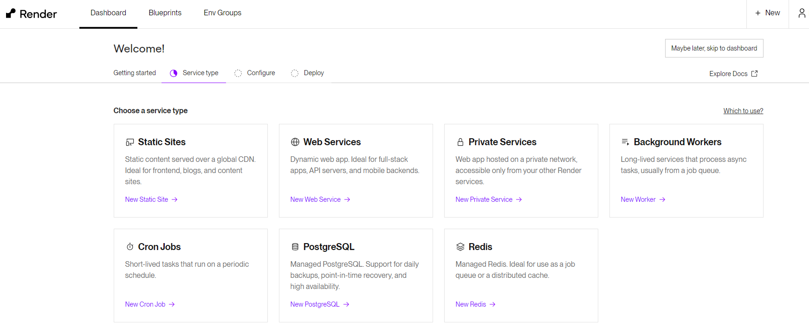

# Renderのアカウントを作成する

RenderはGitHubと連携してデプロイを行うので、あらかじめGitHubのアカウントを用意しておきましょう。あとからGitHubに連携させることもできますが、GitHubアカウント経由でRenderのアカウントを作成した方が簡単です。

1. [https://render.com/](https://render.com/)にアクセスし、`Get Started for Free`をクリックして登録画面を開きます。

    

1. `Create an accountで`GitHubを選択します。

    

    ※GitHubのアカウントを作成してから日が浅いとうまくRenderアカウントが作成できない場合があるようです。そのときは別の方法を選択して作成してください。その場合のGitHubとの連携はWeb Service作成時に行うことになります。

1. GitHubにログインしていなければログインするよう求められるのでログインしてください。

    

1. デバイス認証を行います。メールを確認して認証コードを入力してください。

1. GitHubと連携します。`Authorize Render`をクリックしてください。

    

1. 登録されているメールアドレスを確認して、`Create Account'をクリックします。

    

1. 先ほどのメールアドレスに認証メールが送られているので、メールを開いて中のリンクをクリックします。

1. Renderの利用に関するいくつかの質問のページが開きます。必須なのは最後の質問だけなので最低それだけ入力してから`Continue to Render`をクリックします。

    

    - What should we call you?
        - 自分の名前（ニックネーム）を入力します。
    - How will you primary use Render?
        - 利用目的を選択します。`For personal use`（個人利用）でいいでしょう。
    - What type of project are you building?
        - 作成するプロジェクトの種類を選びます。`Web app`
    - Where is your project hosted?
        - 現在プロジェクトを実行している場所を選択します。AWSやHerokuなどにデプロイしているならそれを選択します。ローカル環境で動かしているだけなら`Project running localy`、これから新しく作るのであれば`Starting a new Project`を選びます。

1. ダッシュボードが表示されれば登録完了です。

    
