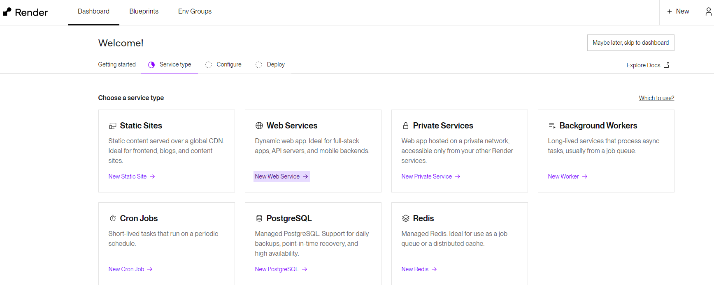
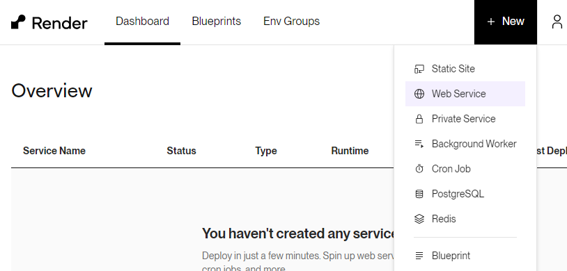
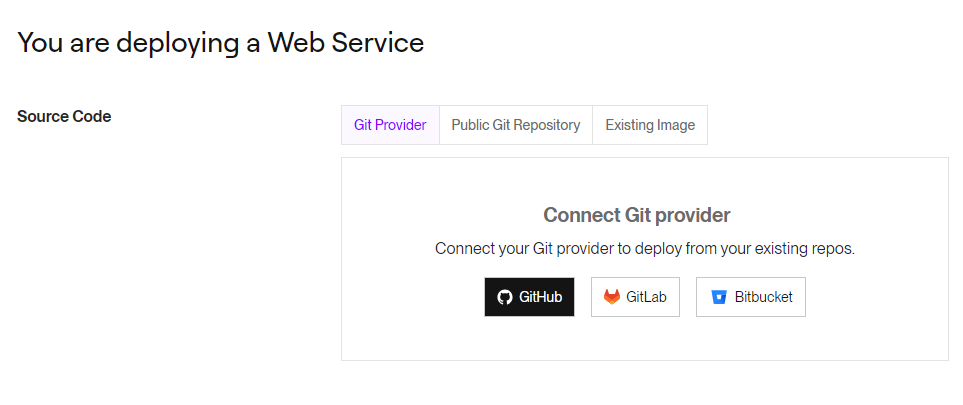
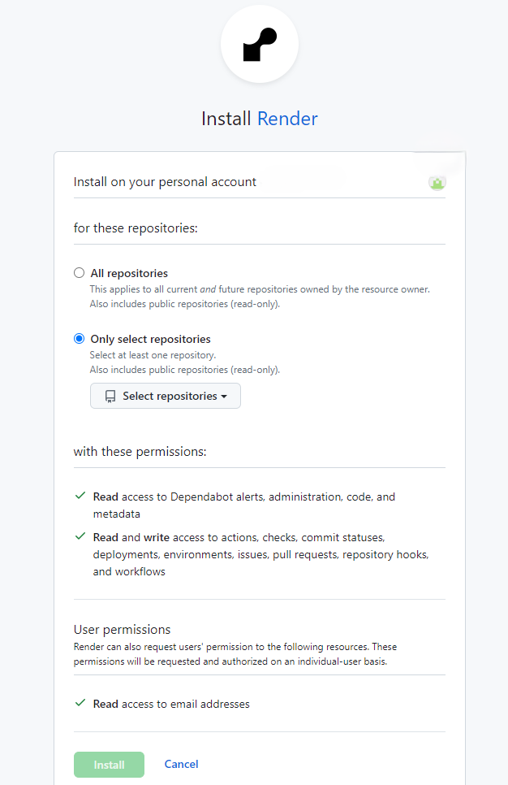
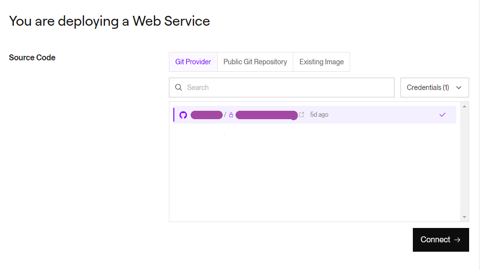
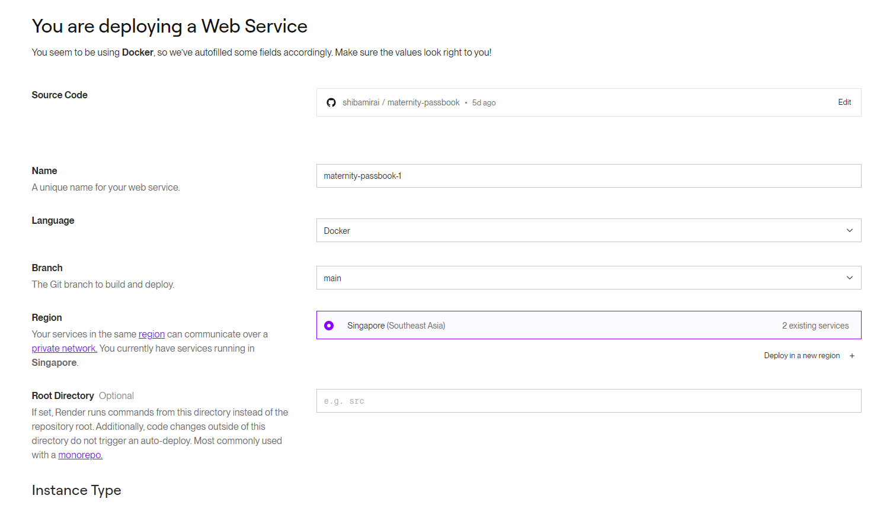
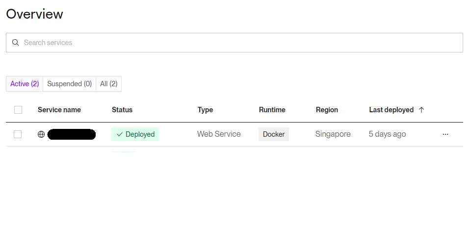

# RenderでWebアプリをデプロイする（共通）

1. Render.comにログインし、Dashboardを開きます。

1. `New Web Service`を選択します。

    

    または、画面右上の`+ New`から`Web Service`を選択します。

    

1. デプロイするプロジェクトの連携先を設定していきます。まずは`Git Provider`から`GitHub`を選択します。すでにデプロイしたことがある場合は、`Credentials`から`Configure GitHub`を選んでください。

    

1. ポップアップが出てくるので、そこでGitHubのアカウントにRenderをインストールします。ここで`All repositories`を選択すると、GitHubに登録されているすべてのプロジェクトだけでなく今後登録するプロジェクトもすべてデプロイされるようになるので、ここでは`Only select repositories`を選択します。すると`Select repositories`というセレクトボックスが現れるので、そこからデプロイするプロジェクトを選択します。

    

1. 選択したプロジェクトがリストに表示されるので、それを選択して`Connect`をクリックします。

    

1. Web Serviceの各種設定を行います。デプロイするアプリによって異なる部分がありますが、共通するところは以下になります。設定後、`Deploy Web Service`をクリックするとデプロイが始まります。

    - Region：Singaporeを選択します。
    - Instance Type：Freeを選択します。

    

1. デプロイ中はDashboardのOverviewで進行状況を確認できます。Statusが'Delployed'Statusが'Delployed'になればデプロイ完了です。Service nameをクリックするとWeb Serviceの詳細を見ることができます。

    

1. デプロイしたサイトは、Web Serviceの詳細の左上の方にある https: から始まるリンクから開くことができます。
